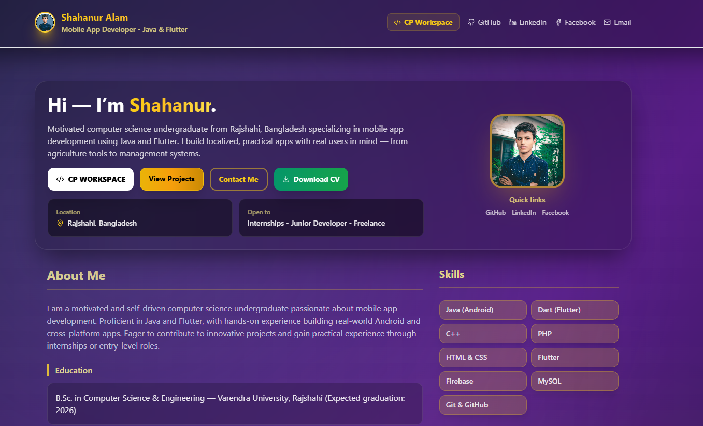

# Shahanur Alam | Portfolio & Zen Workspace



Hi! I'm **Shahanur Alam**, a motivated Computer Science undergraduate from Rajshahi, Bangladesh. I specialize in mobile app development using Java and Flutter, building practical, localized apps for real users.

---

## ⚡ Zen Workspace (CP Platform)
I've integrated a high-performance **Competitive Programming Workspace** into my portfolio. 
- **Automatic Fetching**: Real-time problem aggregation from **Codeforces** (8000+) and **AtCoder** (6000+).
- **Integrated IDE**: Solve problems directly in a distraction-free environment with multi-language support (C++, Python, Java, JS).
- **Smart Filters**: Filter by platform, status (Solved, Favorite, Blocked), or search by problem ID/Title.
- **Load More**: Efficiently browse thousands of problems with paginated loading.

---

## 🚀 Featured Projects

### Blood Donate — Donor Matching (Android)
- **Description**: Connecting donors and recipients with location-based matching and direct contact tools.
- **Tech Stack**: Flutter, Android, Firebase
- **[View on Play Store](https://play.google.com/store/apps/details?id=com.blood_donate_app.bd)**

### Badalgachi Net — ISP App (Android)
- **Description**: ISP customer management, billing, and support app for local internet service users.
- **Tech Stack**: Java, Android, Firebase
- **[View on Play Store](https://play.google.com/store/apps/details?id=com.careconnectstudio.badalgachinet)**

---

## 🛠 Skills & Tools
- **Languages**: Java (Android), Dart (Flutter), C++, PHP, JavaScript, HTML & CSS
- **Frameworks/DB**: Flutter, React, Tailwind CSS, Firebase, MySQL
- **Tools**: Android Studio, VS Code, Git & GitHub

## 📚 Education
- **B.Sc. in Computer Science & Engineering**  
  Varendra University, Rajshahi (Expected: 2026)

## 🏆 Achievements
- **Winner** — University Innovation Hub Competition (Led mobile app development team)

---

## 📞 Contact & Socials
- 📧 **Email**: [shahanuralam.dev@gmail.com](mailto:shahanuralam.dev@gmail.com)
- 📞 **Phone**: +8801518939114
- 📍 **Location**: Rajshahi, Bangladesh
- 🔗 **LinkedIn**: [shahanur-alam](https://www.linkedin.com/in/shahanur-alam/)
- 🐙 **GitHub**: [shahanuralamofficial](https://github.com/shahanuralamofficial)
- 👤 **Facebook**: [ShahanurAlam2k3](https://www.facebook.com/ShahanurAlam2k3)

---

## 💻 Getting Started Locally

1. **Clone the repository**:
   ```bash
   git clone https://github.com/shahanuralamofficial/shahanuralam.git
   cd shahanuralam
   ```

2. **Install dependencies**:
   ```bash
   npm install
   ```

3. **Start the development server**:
   ```bash
   npm start
   ```

4. **Open** [http://localhost:3000/shahanuralam](http://localhost:3000/shahanuralam) in your browser.

---

## 🚀 Deployment
This portfolio is built with **React & Tailwind CSS** and is automatically deployed to **GitHub Pages**.
